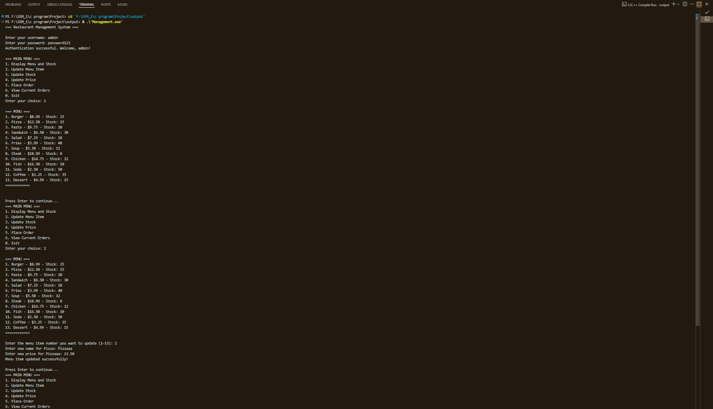

# 🍽️ Canteen Management System (C Project)

This is a console-based Canteen Management System built as a part of my first-semester C programming course.

## 🛠️ Features
- Add/Edit/Delete Menu Items
- Place Orders
- Calculate Bills
- Admin Login

## 💻 Tech Stack
- Language: C
- IDE: Code::Blocks / Turbo C / GCC

## 📸 Screenshots

